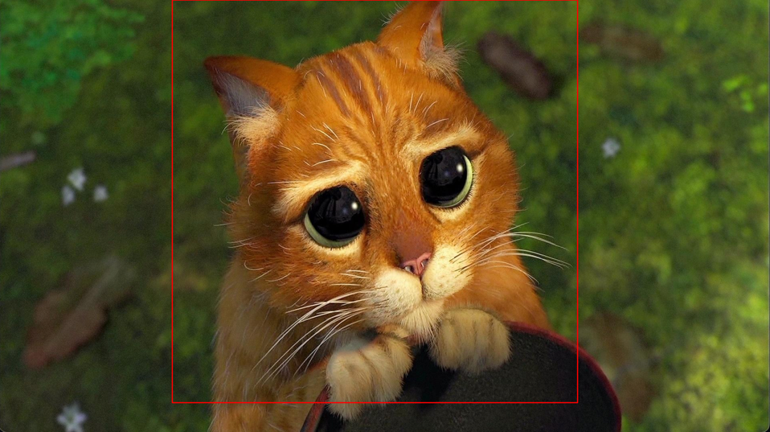
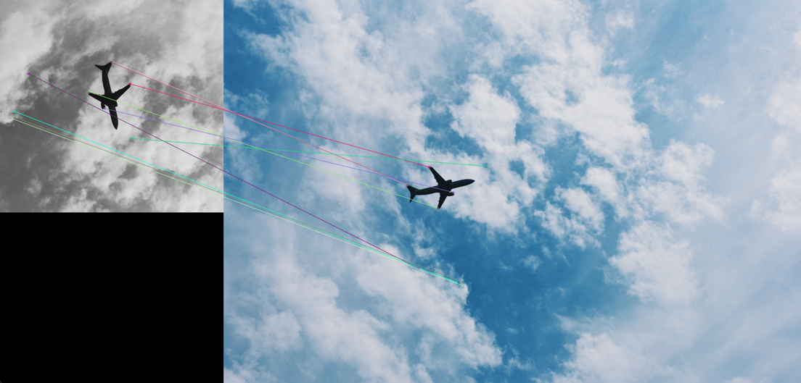
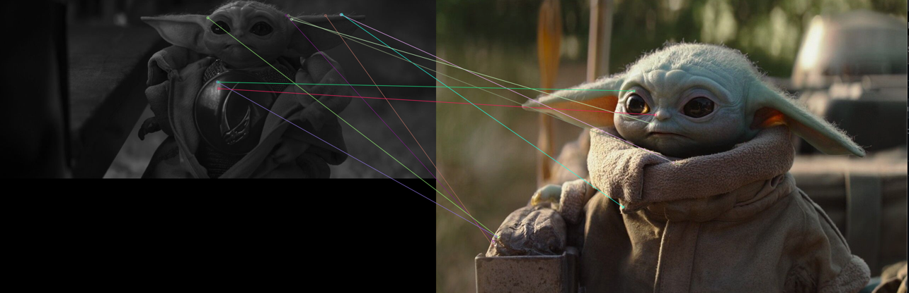

# Отчёт по 2-й лабораторной работе MCV

## Теоретическая база
Сопоставление изображений — это процесс нахождения определённых объектов или шаблонов в изображениях.
Для выполнения данной лабораторной работы использовано 2 метода:

1. **Прямой поиск по шаблону (Template Matching):** Этот метод заключается в сравнении заданного шаблона с участками изображения, чтобы найти совпадения. Он использует различные алгоритмы сопоставления, такие как нормализованная корреляция (TM_CCOEFF_NORMED), чтобы определить, насколько хорошо шаблон соответствует части изображения.
2. **Поиск ключевых точек (Keypoint Detection):** Этот метод включает в себя обнаружение уникальных точек на изображении, которые могут быть использованы для сопоставления. Алгоритмы, такие как SIFT (Scale-Invariant Feature Transform) и ORB (Oriented FAST and Rotated BRIEF), позволяют находить и описывать ключевые точки, что делает их устойчивыми к изменениям масштаба и поворота.
## Описание разработанной системы
### Алгоритмы и принципы работы:
1. **Прямой поиск по шаблону:** 
   - загружаются два изображения: эталон и целевое.
   - Применяется функция cv2.matchTemplate() для поиска шаблона в целевом изображении.
   - Результаты сопоставления обрабатываются с использованием cv2.minMaxLoc(), чтобы найти координаты наилучшего совпадения.
   - На изображении рисуется рамка вокруг найденного объекта.
2. **Поиск ключевых точек:**
   - Загружаются те же два изображения.
   - Используются алгоритмы SIFT или ORB для обнаружения ключевых точек и их дескрипторов.
   - Применяется метод сопоставления ключевых точек (например, FLANN или BFMatcher) для нахождения соответствий между эталоном и целевым изображением.
   - Рисуются линии между соответствующими ключевыми точками на изображениях.

## Архитектура
Система состоит из **следующих компонентов:**
1. Модуль загрузки изображений.
2. Модуль обработки изображений с использованием OpenCV.
3. Модуль визуализации результатов с помощью Matplotlib или OpenCV.

## Результаты работы и тестирования системы
**Для тестирования были выбраны 10 различных наборов изображений, включая:**
   - Эталоны, вырезанные из целевого изображения.
   - Изображения предметов, снятых под разными углами.

### Результаты:
   **Прямой поиск по шаблону:**
   Успешно обнаружены объекты при высоком качестве совпадения.
   Проблемы возникли при изменении масштаба или угла наклона объектов.

   ## Изображения:

   **Поиск ключевых точек:**
   Более устойчив к изменениям масштаба и угла наклона.
   Позволяет находить несколько совпадений в одном изображении.
   Скриншоты и графики результатов можно будет найти в репозитории на GitHub.

### Результаты:

### Выводы по работе
**Точность:**
Метод поиска ключевых точек показал более высокую точность при изменениях в масштабе и ориентации объектов по сравнению с прямым поиском по шаблону.

**Производительность**: 
Template Matching быстрее в простых случаях, но менее эффективен при сложных условиях.
 
**Применимость**: Выбор метода зависит от конкретной задачи; для статичных объектов лучше использовать Template Matching, а для динамичных сцен — поиск ключевых точек.